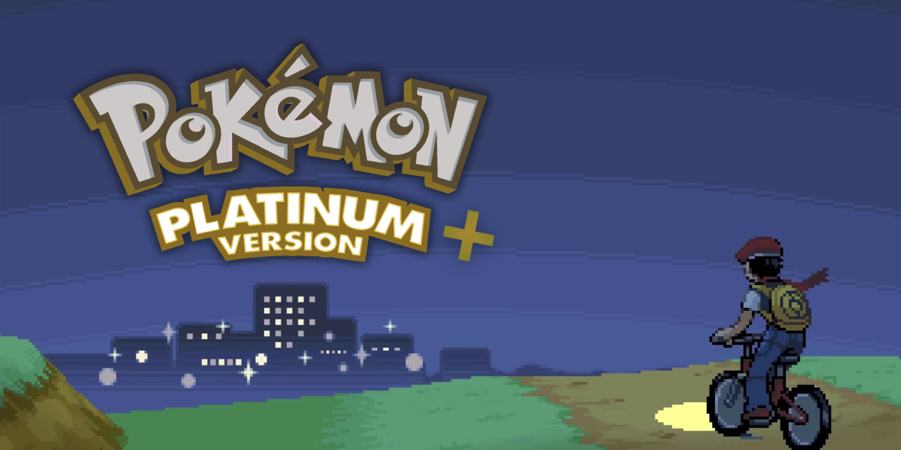

<div align="center">

**A Pokémon Platinum romhack that never leaves <br/> Gen 4, and never stops growing.**

*New content, old soul.*



</div>

## Overview

**Platinum stays Platinum.**

No jump to a later generation, no engine swap. The Gen 4 baseline is the point, not a limitation.

From there, it grows without end: new areas and challenges, new systems, quality-of-life, small mechanical tweaks. 

Everything is built inside the world the game already has, never bolted onto a newer one.

## Building

Toolchain setup is unchanged from upstream. See [`INSTALL.md`](INSTALL.md).

```sh
make rom     # build → build/pokeplatinum.us.nds
make run     # build, then launch in melonDS
```

The result runs on real hardware or in any DS emulator (melonDS, DeSmuME).

`make check` asserts the build is byte-for-byte identical to retail Platinum.

**It fails here by design.** That's what a romhack is. Use `make rom`.

## Credits

The decompilation is entirely [pret](https://pret.github.io/)'s work.
This fork builds on top of it and does not aim to contribute upstream.